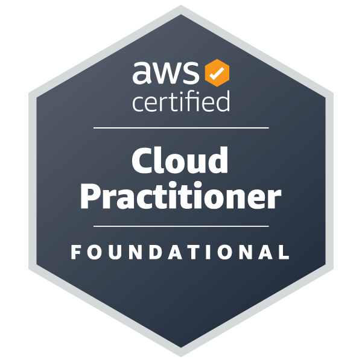

Hi 👋🏽, I'm Bekalu.
Thanks for visiting my GitHub.

## 💻 Experience:

- Graduate Teaching Assistant (GTA) at North Dakota State University
- Data Engineer - University of Regensburg - Germany
- NLP Masters Thesis Student - University of Rostock - Germany
- Data Analysis Project - University of Rostock - Germany
- Customer Service Officer - Ethio Telecom - Ethiopia
- Electrical Engineer - General Power PLC - Ethiopia

## 🏅 Certifications

   
  

## :mortar_board: Education:

- MSc, Computer Science - North Dakota State University (NDSU) (May, 2025)
- MSc, Information Technology - Universität Rostock - Germany (Apr, 2022)
- BSc, Electrical Engineering - Jimma University - Ethiopia (Jul, 2015)

### 🔥 I'm interested in:

- Data Engineering & Pipeline Automation
- AWS Cloud

#### :hammer_and_wrench: I love working with:

<!--

  comment out

 #### Freelance

 

  --->

#### 📫 Reach me via:

&nbsp;

 <!-- Github activity  --->

&nbsp;

